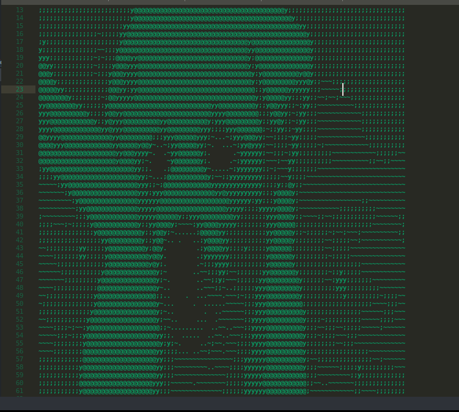
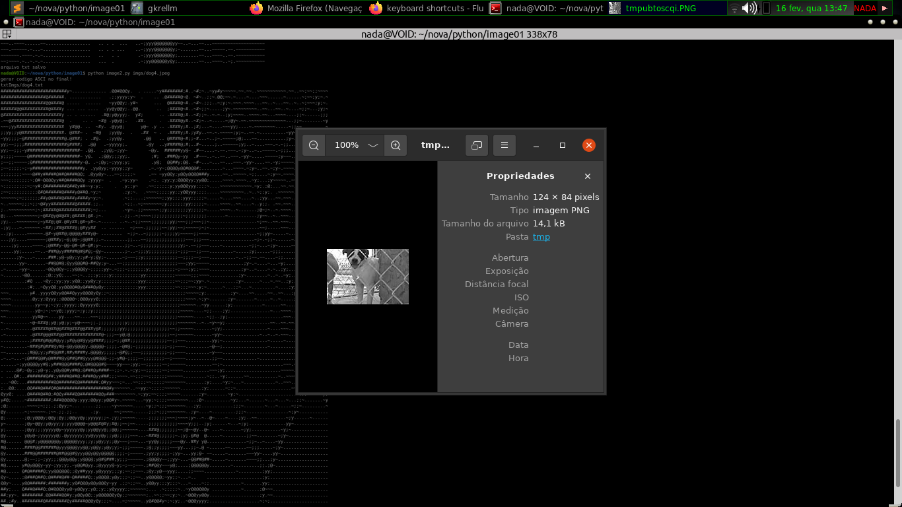
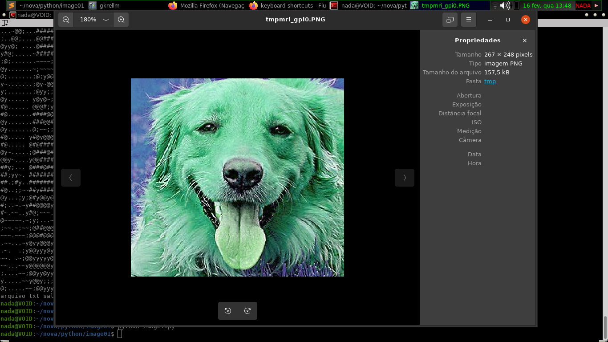

# imagination1
Um estudo de arrays multidimensionais utilizando os pixels de uma imagem

#utilização.

imagem1.py path_da_imagem 

imagem2.py path_da_imagem

Este app simples, é uma demonstração da forma mais dificil de se abrir uma imagem.
transformando ela em array para ter acesso e poder manipular cada pixel da imagem.

é isto que imagem1.py faz, abre a imagem como array e (as vezes)inverte os valores de cores, só.

imagem2.py já é mais interessante:

  será aplicado um simples algoritimo em cima de cada pixel, que matematicamente transforma a imagem para 'PRETO E BRANCO'
  
  O interessante de fazer esta simples mundança é que com a imagem no formato preto e branco, eu posso rodar outro algoritimo e transforma-la em texto
  (CASO SEJA UMA IMAGEM PEQUENA = <120px²)
  
  ...segue imagens de screenshot do terminal e do arquivo txt
  
  
  
  
  Exemplo da execução do arquivo 'image1.py'
  
